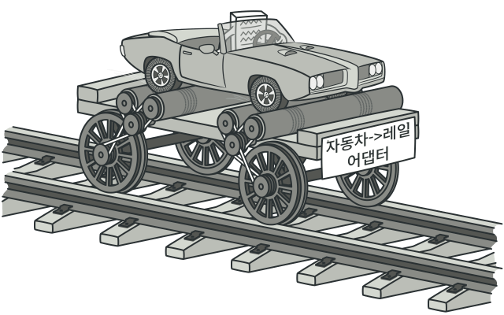

# 어댑터 패턴

어댑터는 호환되지 않는 인터페이스를 가진 객체들이 협업할 수 있도록 하는 구조적 디자인 패턴입니다.

어댑터는 한 객체의 인터페이스를 다른 객체가 이해할 수 있도록 변환하는 특별한 객체입니다.

어댑터는 데이터를 다양한 형식으로 변환할 수 있을 뿐만 아니라 다른 인터페이스를 가진 객체들이 협업하는 데에도 도움을 줄 수 있으며, 대략 다음과 같이 작동합니다:

어댑터는 기존에 있던 객체 중 하나와 호환되는 인터페이스를 받습니다.
이 인터페이스를 사용하면 기존 객체는 어댑터의 메서드들을 안전하게 호출할 수 있습니다.
호출을 수신하면 어댑터는 이 요청을 두 번째 객체에 해당 객체가 예상하는 형식과 순서대로 전달합니다.
때로는 양방향으로 호출을 변환할 수 있는 양방향 어댑터를 만드는 것도 가능합니다.
