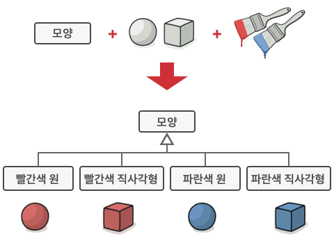
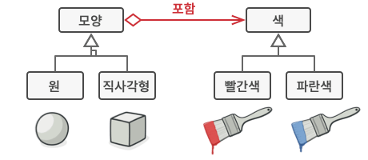

# 브리지 패턴

브리지는 큰 클래스 또는 밀접하게 관련된 클래스들의 집합을 두 개의 개별 계층구조​(추상화 및 구현)​로 나눈 후 각각 독립적으로 개발할 수 있도록 하는 구조 디자인 패턴입니다.

브리지 패턴은 상속에서 객체 합성으로 전환하여 이 문제를 해결하려고 시도합니다. 이것이 의미하는 바는 차원 중 하나를 별도의 클래스 계층구조로 추출하여 원래 클래스들이 한 클래스 내에서 모든 상태와 행동들을 갖는 대신 새 계층구조의 객체를 참조하도록 한다는 것입니다.

이 접근 방식을 따르면, 색상 관련 코드를 Red 및 Blue라는 두 개의 자식 클래스들이 있는 자체 클래스로 추출할 수 있습니다. 그런 다음 Shape 클래스는 색상 객체들 중 하나를 가리키는 참조 필드를 받습니다. 이제 모양은 연결된 색상 객체에 모든 색상 관련 작업을 위임할 수 있습니다. 이 참조는 Shape 및 Color 클래스들 사이의 브리지​(다리) 역할을 할 것입니다. 이제부터 새 색상들을 추가할 때 모양 계층구조를 변경할 필요가 없으며 그 반대의 경우도 마찬가지입니다.

브리지 패턴은 당신이 어떤 기능의 여러 변형을 가진 모놀리식 클래스를 나누고 정돈하려 할 때 사용하세요. (예: 클래스가 다양한 데이터베이스 서버들과 작동할 수 있는 경우).
클래스가 성장할수록 그 작동 방식을 파악하기가 더 어려워지고 해당 클래스를 변경하는 데 더더욱 오랜 시간이 걸립니다. 클래스 기능의 여러 변형 중 하나를 변경하려면 클래스 전체에 걸쳐 여러 가지 변경을 수행해야 할 수 있으며, 이를 수행 중 개발자들은 종종 실수하거나 일부 중요한 부작용들을 해결하지 않기도 합니다.

브리지 패턴을 사용하면 모놀리식 클래스를 여러 클래스 계층구조로 나눌 수 있습니다. 그런 다음 각 계층구조의 클래스들을 다른 계층구조들에 있는 클래스들과는 독립적으로 변경할 수 있습니다. 이 접근 방식은 코드의 유지관리를 단순화하고 기존 코드가 손상될 위험을 최소화합니다.

이 패턴은 여러 직교​(독립) 차원에서 클래스를 확장해야 할 때 사용하세요.

브리지 패턴은 각 차원에 대해 별도의 클래스 계층구조를 추출할 것을 제안합니다. 원래 클래스는 모든 작업을 자체적으로 수행하는 대신 추출된 계층구조들에 속한 객체들에 관련 작업들을 위임합니다.

브리지 패턴은 런타임​(실행시간)​에 구현을 전환할 수 있어야 할 때에 사용하세요.

선택 사항이지만 브리지 패턴을 사용하면 추상화 내부의 구현 객체를 바꿀 수 있으며, 그렇게 하려면 필드에 새 값을 할당하기만 하면 됩니다.

위 항목은 많은 사람이 브리지와 전략 패턴을 혼동하는 주된 이유입니다. 패턴은 클래스의 구조를 설계하는 특정 방법 그 이상의 것이라는 것을 기억하세요. 패턴은 제기되고 있는 문제 및 의도에 대하여도 소통할 수 있습니다.

클래스에서 직교 차원들을 식별하세요. 이러한 독립적인 개념들은 추상화/플랫폼, 도메인/인프라, 프런트엔드/백엔드 또는 인터페이스/구현 등일 수 있습니다.
