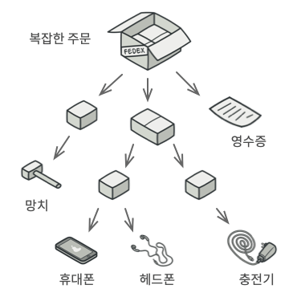

# 복합체 패턴

어떤 문제가 재귀적인 패턴을 사용해서 해결할 수 있을 때 사용가능하다

예를 들어 상자 안에는 물건과 물건을 담은 상자들이 여러 개 있을 때,
상자 안에 있는 모든 물건 가격의 총합을 구해야 하는 경우에 이 패턴을 쓸 수 있다.

복합체 패턴은 총가격을 계산하는 메서드를 선언하는 공통 인터페이스를 통해 제품들 및 상자들 클래스들과 작업할 것을 제안합니다.

그러면 이 메서드는 어떻게 작동할까요? 제품의 경우 이 메서드는 단순히 제품 가격을 반환합니다. 상자의 경우, 이 메서드는 상자에 포함된 각 항목을 살펴보고 가격을 확인한 뒤 해당 상자의 총 가격을 반환합니다. 만약 이 항목들 중 하나가 더 작은 상자라면, 메서드는 해당 상자의 모든 내부 구성 요소의 가격이 계산될 때까지 내용물 등을 살펴봅니다. 메서드는 상자를 다룰 때 최종 가격에 포장 비용 같은 약간의 추가 비용도 추가할 수도 있습니다.

## 장점

이 접근 방식의 가장 큰 이점은 더 이상 트리를 구성하는 객체들의 구상 클래스들에 대해 신경 쓸 필요도, 또 물건이 단순한 제품인지 내용물이 있는 상자인지 알 필요도 없다는 점입니다. 단순히 공통 인터페이스를 통해 모두 같은 방식으로 처리하시면 됩니다. 당신이 메서드를 호출하면 객체들 자체가 요청을 트리 아래로 전달합니다.

## 구성방식

컴포넌트 인터페이스는 트리의 단순 요소들과 복잡한 요소들 모두에 공통적인 작업을 설명합니다.

잎은 트리의 기본 요소이며 하위요소가 없습니다.

일반적으로 잎 컴포넌트들은 작업을 위임할 하위요소가 없어서 대부분의 실제 작업들을 수행합니다.

컨테이너(일명 복합체)​는 하위 요소들​(잎 또는 기타 컨테이너)​이 있는 요소입니다. 컨테이너는 자녀들의 구상 클래스들을 알지 못하며, 컴포넌트 인터페이스를 통해서만 모든 하위 요소들과 함께 작동합니다.

요청을 전달받으면 컨테이너는 작업을 하위 요소들에 위임하고 중간 결과들을 처리한 다음 최종 결과들을 클라이언트에 반환합니다.

클라이언트는 컴포넌트 인터페이스를 통해 모든 요소들과 작동합니다. 그 결과 클라이언트는 트리의 단순 요소들 또는 복잡한 요소들 모두에 대해 같은 방식으로 작업할 수 있습니다.
