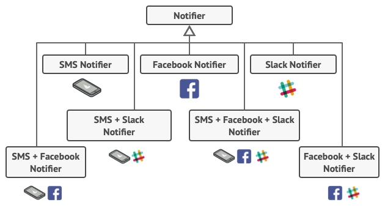
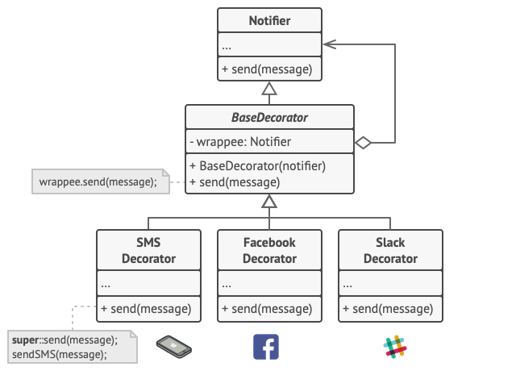
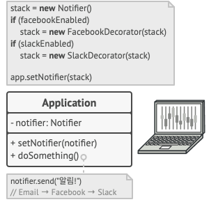
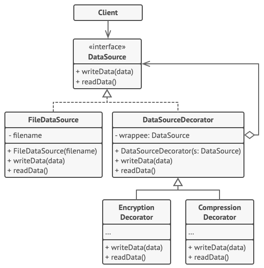

# 데코레이터 패턴

데코레이터는 객체들을
새로운 행동들을 포함한 특수 래퍼 객체들 내에 넣어서
위 행동들을 해당 객체들에 연결시키는 구조적 디자인 패턴입니다.

## 문제 상황


그런데 누군가 당신에게 물었습니다. '여러 유형의 알림을 한 번에 사용할 수는 없나요? 집에 불이라도 난다면 사용자들은 모든 채널에서 정보를 받고 싶어 할 겁니다.'

이 문제를 해결하기 위해 당신은 하나의 클래스 내에서 여러 알림 메서드를 합성한 특수 자식 클래스들을 만들었으나, 이 접근 방식은 라이브러리 코드뿐만 아니라 클라이언트 코드도 엄청나게 부풀릴 것이라는 사실이 금세 명백해졌습니다.

## 해결 방안

객체의 동작을 변경해야 할 때 가장 먼저 고려되는 방법은 클래스의 확장입니다. 그러나 상속에는 당신이 심각하게 주의해야 할 몇 가지 사항들이 있습니다.

상속은 정적입니다: 당신은 런타임​(실행시간) 때 기존 객체의 행동을 변경할 수 없습니다. 당신은 전체 객체를 다른 자식 클래스에서 생성된 다른 객체로만 바꿀 수 있습니다.
자식 클래스는 하나의 부모 클래스만 가질 수 있습니다. 대부분 언어에서의 상속은 클래스가 동시에 여러 클래스의 행동을 상속하도록 허용하지 않습니다.

=> 상속 대신 집합 관계 또는 합성 을 사용하는 것입니다.
집합 관계에서는 한 객체가 다른 객체에 대한 참조를 갖고 일부 작업을 위임

데코레이터 역할을 하는 것을 만든다 ; 래퍼
메서드 집합을 포함하고 있음.

=> 대상 객체에 자신이 받은 요청을 위임한다.
대신에 요청 전후로 어떤 추가적인 작업을 해서 결과를 변경할 수 있음

앞서 언급했듯이 래퍼는 래핑된 객체와 같은 인터페이스를 구현합니다. 그러므로 클라이언트의 관점에서 이러한 객체들은 같습니다. 이제 래퍼의 참조 필드가 해당 인터페이스를 따르는 모든 객체를 받도록 하세요. 이렇게 하면 여러 래퍼로 객체를 포장해서 모든 래퍼들의 합성된 행동들을 객체에 추가할 수 있습니다.




단, 모든 데코레이터들은 기초 알림자와 같은 인터페이스를 구현해야함


// 컴포넌트 인터페이스는 데코레이터들이 변경할 수 있는 작업들을 정의합니다.
// 기초 데코레이터 클래스는 다른 컴포넌트들과 같은 인터페이스를 따릅니다. 이
// 클래스의 주목적은 모든 구상 데코레이터에 대한 래핑 인터페이스를 정의하는
// 것입니다. 래핑 코드의 디폴트 구현에는 래핑된 컴포넌트를 저장하기 위한 필드와
// 이를 초기화하는 수단들이 포함될 수 있습니다.

// 기초 데코레이터는 단순히 모든 작업을 래핑된 컴포넌트에 위임합니다. 구상
// 데코레이터들에는 추가 행동들이 추가될 수 있습니다.

```
// 앱은 설정 또는 환경에 따라 런타임 때 다양한 데코레이터 스택들을 조합할 수
// 있습니다.

class ApplicationConfigurator is
    method configurationExample() is
        source = new FileDataSource("salary.dat")
        if (enabledEncryption)
            source = new EncryptionDecorator(source)
        if (enabledCompression)
            source = new CompressionDecorator(source)

        logger = new SalaryManager(source)
        salary = logger.load()
    // …
```

어댑터는 기존 객체의 인터페이스를 변경하는 반면 데코레이터는 객체를 해당 객체의 인터페이스를 변경하지 않고 향상합니다. 또한 데코레이터는 어댑터를 사용할 때는 불가능한 재귀적 합성을 지원합니다.

데코레이터는 객체의 피부를 변경할 수 있고 전략 패턴은 객체의 내장을 변경할 수 있다고 비유할 수 있습니다.
