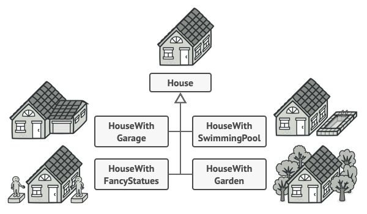
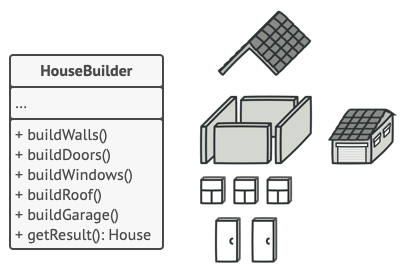

# 빌더 패턴 

복잡한 객체들을 단계별로 생성함
같은 제작 코드를 써서 객체의 다양한 유형들과 표현을 제작한다

필요한 상황

매개변수가 많은 생성자의 단점은 모든 매개변수가 항상 필요한 것은 아니라는 점입니다.

해결책

빌더 패턴은 복잡한 객체들을 단계별로 생성할 수 있도록 합니다. 빌더는 제품이 생성되는 동안 다른 객체들이 제품에 접근​(access)​하는 것을 허용하지 않습니다.

이 패턴은 객체 생성을 일련의 단계들​(build­Walls​(벽 건설), build­Door​(문 건설) 등)​로 정리하며, 객체를 생성하고 싶으면 위 단계들을 builder(빌더) 객체에 실행하면 됩니다. 또 중요한 점은 모든 단계를 호출할 필요가 없다는 것으로, 객체의 특정 설정을 제작하는 데 필요한 단계들만 호출하면 됩니다.

같은 건축 단계들의 집합을 다른 방식으로 구현하는 여러 다른 빌더 클래스를 생성할 수 있으며, 그런 다음 건축 프로세스​(즉, 건축 단계에 대한 순서화된 호출들의 집합)​내에서 이러한 빌더들을 사용하여 다양한 종류의 객체를 생성할 수 있습니다.

더 나아가 제품을 생성하는 데 사용하는 빌더 단계들에 대한 일련의 호출을 디렉터 (관리자)라는 별도의 클래스로 추출할 수 있습니다. 디렉터 클래스는 제작 단계들을 실행하는 순서를 정의하는 반면 빌더는 이러한 단계들에 대한 구현을 제공합니다.

디렉터 클래스는 다양한 생성 루틴들을 배치하여 프로그램 전체에서 재사용할 수 있는 좋은 장소가 될 수 있습니다.

또한 디렉터 클래스는 클라이언트 코드에서 제품 생성의 세부 정보를 완전히 숨깁니다. 클라이언트는 빌더를 디렉터와 연관시키고 디렉터와 생성을 시행한 후 빌더로부터 결과를 얻기만 하면 됩니다.