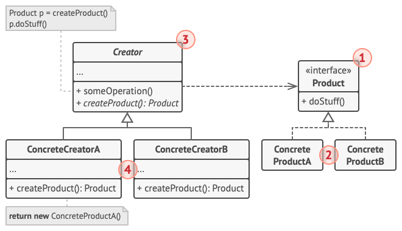

# 생성 패턴

기존코드의 유연성과 재사용을 증대시킨다.

- 팩토리 메서드
- 추상 팩토리
- 빌더
- 프로토타입
- 싱글턴

##팩토리 메서드

부모 클래스에서 객체를 생성하는 인터페이스를 제공한다.
단, 자식 클래스들이 생성된 객체들의 유형을 변경할 수 있다.

GO 언어에서는 어떻게 구현할 수 있나?
객체지향과 상속의 개념이 없지만 단순하게는 구현이 가능하다.

```
1. 생성된 객체가 가져야하는 공통 메서드를 인터페이스에 정의한다.
2. 해당 인터페이스의 메서드를 구현하는 구조체, 즉 팩토리를 구현한다. 이 팩토리는 구체적인 객체들이 공통적으로 사용하는 공통 비즈니스 로직을 가지고 있어야 한다.
3. 2의 구조체 타입을 포함하는 구체적인 구조체 타입을 정의한다. 그러면 이 단계에서 생성된 인스턴스는 1의 메서드를 구현했기 때문에, 이를 2에서 수정해도 이를 물려받는 모든 구체적인 구초체들이 가진 메서드가 수정된다.
```
