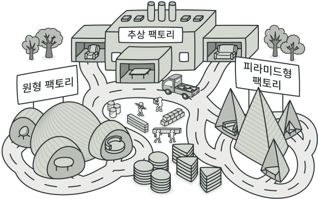
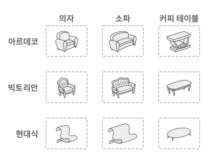
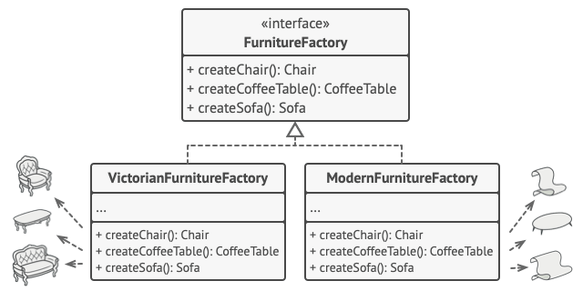

# 생성 패턴

기존코드의 유연성과 재사용을 증대시킨다.

- 팩토리 메서드
- 추상 팩토리
- 빌더
- 프로토타입
- 싱글턴

##팩토리 메서드

부모 클래스에서 객체를 생성하는 인터페이스를 제공한다.
단, 자식 클래스들이 생성된 객체들의 유형을 변경할 수 있다.

GO 언어에서는 어떻게 구현할 수 있나?
객체지향과 상속의 개념이 없지만 단순하게는 구현이 가능하다.

```
1. 생성된 객체가 가져야하는 공통 메서드를 인터페이스에 정의한다.
2. 해당 인터페이스의 메서드를 구현하는 구조체, 즉 팩토리를 구현한다. 이 팩토리는 구체적인 객체들이 공통적으로 사용하는 공통 비즈니스 로직을 가지고 있어야 한다.
3. 2의 구조체 타입을 포함하는 구체적인 구조체 타입을 정의한다. 그러면 이 단계에서 생성된 인스턴스는 1의 메서드를 구현했기 때문에, 이를 2에서 수정해도 이를 물려받는 모든 구체적인 구초체들이 가진 메서드가 수정된다.
```

##추상 팩토리
관련 객체들의 구상 클래스들을 지정하지 않아도, 관련 객체 모음을 생성할 수 있도록 한다. => 잦은 변경에 유리함


관련 제품들로 형성된 패밀리​(제품군), 예: Chair​(의자) + Sofa​(소파) + Coffee­Table​(커피 테이블).

해당 제품군의 여러 가지 변형. 예를 들어 Chair​(의자) + Sofa​(소파) + Coffee­Table​(커피 테이블) 같은 제품들은 Modern​(현대식), Victorian​(빅토리안), Art­Deco​(아르데코 양식)​와 같은 변형으로 제공됩니다.


규칙:
제품 패밀리​(제품군)​에 해당하는 개별적인 인터페이스를 명시적으로 선언하고 제품의 모든 변형이 위 인터페이스를 따르도록한다.

추상 팩토리 패턴을 선언하는 것입니다. 추상 공장 패턴은 제품 패밀리 내의 모든 개별 제품들의 생성 메서드들이 목록화되어있는 인터페이스.


유의:
일반적으로 프로그램은 초기화 단계에서 구상 팩토리 객체를 생성합니다. 그 직전에 프로그램은 환경 또는 구성 설정에 따라 팩토리 유형을 선택해야 합니다.
