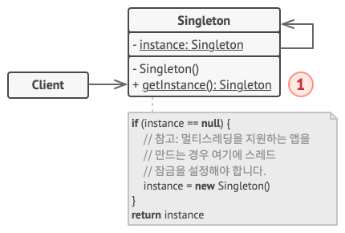

# 싱글턴 패턴

클래스에 인스턴스가 하나만 있도록 하면서 이 인스턴스에 대한 전역 접근​(액세스) 지점을 제공

## 어떤 경우 필요한가

공유 리소스에 대한 접근 제어 - 데이터베이스 등
(클라이언트들은 항상 같은 객체와 작업하고 있다는 사실을 인식조차 못 할 수 있습니다.)

전역 접근 지점을 제공한다. (다른 코드가 해당 인스턴스를 덮어쓰지 못하도록 보호)

## 생성방법

다른 객체들이 싱글턴 클래스와 함께 new 연산자를 사용하지 못하도록 디폴트 생성자를 비공개로 설정하세요.
생성자 역할을 하는 정적 생성 메서드를 만드세요.
내부적으로 이 메서드는 객체를 만들기 위하여 비공개 생성자를 호출한 후 객체를 정적 필드에 저장합니다.
이 메서드에 대한 그다음 호출들은 모두 캐시된 객체를 반환합니다



싱글턴 클래스는 정적 메서드 get­Instance를 선언합니다. 이 메서드는 자체 클래스의 같은 인스턴스를 반환합니다.

싱글턴의 생성자는 항상 클라이언트 코드에서부터 숨겨져야 합니다. get­Instance 메서드를 호출하는 것이 Singleton 객체를 가져올 수 있는 유일한 방법이어야 합니다.

```
// 싱글턴 인스턴스로의 접근을 제어하는 정적 메서드.
    public static method getInstance() is
        if (Database.instance == null) then
            acquireThreadLock() and then
                // 이 스레드가 잠금 해제를 기다리는 동안 인스턴스가 다른
                // 스레드에 의해 초기화되지 않았는지 확인하세요.
                if (Database.instance == null) then
                    Database.instance = new Database()
        return Database.instance
```

## 단점:

단일 책임 원칙을 위반합니다. 이 패턴은 한 번에 두 가지의 문제를 동시에 해결합니다.
또 싱글턴 패턴은 잘못된 디자인​(예를 들어 프로그램의 컴포넌트들이 서로에 대해 너무 많이 알고 있는 경우)​을 가릴 수 있습니다.

그리고 이 패턴은 다중 스레드 환경에서 여러 스레드가 싱글턴 객체를 여러 번 생성하지 않도록 특별한 처리가 필요합니다. => 뮤텍스 락

싱글턴의 클라이언트 코드를 유닛 테스트하기 어려울 수 있습니다. 그 이유는 많은 테스트 프레임워크들이 모의 객체들을 생성할 때 상속에 의존하기 때문입니다.

싱글턴 클래스의 생성자는 비공개이고 대부분 언어에서 정적 메서드를 오버라이딩하는 것이 불가능하므로 싱글턴의 한계를 극복할 수 있는 창의적인 방법을 생각해야 합니다. 아니면 그냥 테스트를 작성하지 말거나 싱글턴 패턴을 사용하지 않으면 됩니다.

싱글턴은 전역 변수들과 거의 같은 장단점을 가지고 있습니다: 매우 편리하나 코드의 모듈성을 깨뜨립니다.

싱글턴에 의존하는 클래스를 다른 콘텍스트에서 사용하려면 싱글턴도 다른 콘텍스트로 전달해야 합니다. 대부분의 경우 이 제한 사항은 유닛 테스트를 생성하는 동안 발생합니다.
