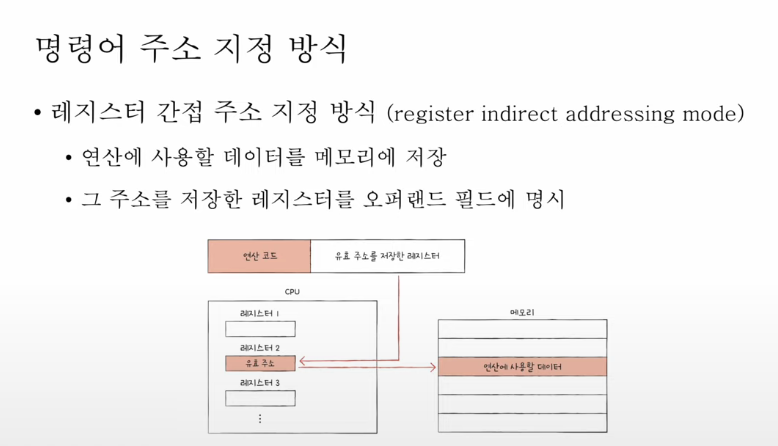

# 명령어의 구조, 주소지정방식

명령어의 구조
무엇을 대상으로 무엇을 수행해라

(예) 더해라, 100과 20을
즉 수행할 연산과 수행 대상을 명시하고있다

명령어 = 연산 코드 + operand(연산데이터, 또는 그것의 저장위치)
기계어와 어셈블리어도 명령어다.

[] 연산코드
cpu마다 각기 다르게 가지고 있다.
종류:

1. 데이터전송 (이동하거나 저장하거나, 메모리에서 cpu로 데이터 가져오거나, 스택에 데이터 저장, 스택의 최상단 데이터 가져오거나..)
2. 산술논리연산: 사칙연산, 비교연산, AND, OR, NOT 연산
3. 제어흐름변경: 특정 메모리주소로 실행 순서를 옮기거나, 실행을 멈추거나, 특정 주소로 돌아가거나..
4. 입출력제어

[] operand
연산 데이터의 저장 위치 => 이 위치를 훨씬 더 자주 저장하게 된다.
그래서 operand를 주소 필드라고도 부른다.
(operand가 없을 수도 있음)
명령어에서 표현할 수 있는 데이터 크기에 제한이 있기 때문에 주소값을 보여주는 게 더 효율적이다
명령어 크기가 제한되어 있으면, operand 내에 들어가는 데이터 크기에 제한이 있다.

유효 주소: 연산에 쓰는 데이터가 저장된 위치

CPU 입장에서는 operand의 저장 형식과 상관없이 데이터를 찾을 수 있어야 한다.
(=유효 주소를 찾는 방법)

- 즉시 주소 지정 방식: 연산에 쓸 데이터를 오퍼랜드 필드에 직접 명시. 데이터 크기가 제한되지만 메모리나 레지스터 조회 없이 빠르게 연산이 가능하다

* 직접 주소 지정 방식: 유효주소를 표현할 수 있는 크기가 줄어듬
* 간접 주소 지정 방식: 유효 주소의 주소를 명시하는데, 앞선 방식에 비해 메모리를 찾아가는 과정이 더 있어서 속도가 느리다.

* 레지스터 주소 지정 방식: 연산에 쓸 데이터가 저장된 레지스터를 명시한다.
  메모리에 접근(직접 주소 지정 방식)하는 것보다는, 레지스터에 접근하는 게 빠르다. CPU안에 레지스터가 있으니까.
* 레지스터 간접 주소 지정 방식: 연산에 쓸 데이터를 메모리에 두고,
  그 주소를 저장한 레지스터를 필드에 명시함
  
