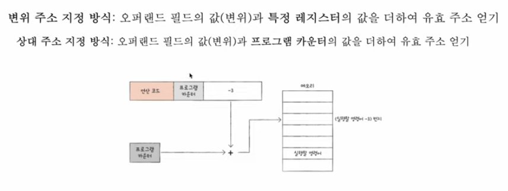
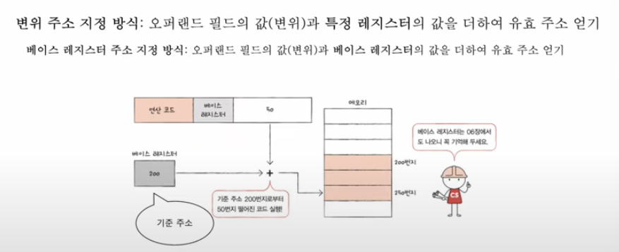

# 레지스터

레지스터는 실행할 명령어와 데이터를 임시로 저장하는 공간으로 메모리에 접근하는 시간을 줄이기 위해 사용하는 CPU내의 저장장치

## 레지스터의 종류.

1. 프로그램 카운터
2. 메모리 주소 레지스터
3. 메모리 버퍼 레지스터
4. 명령어 레지스터: 제어장치가 이를 해석하고 제어신호를 발생시킨다.
5. 플래그 레지스터
6. 범용 레지스터
7. 스택 포인터
8. 베이스 레지스터

## 동작과정

프로그램을 구성하는 명령어가 메모리의 1000- 2000번지에 저장되어 있다고 가정하자.
프로그램 카운터는 다음으로 실행할 명령어의 번지수를 저장하기 때문에 프로그램이 시작될 때 1000번지라는 정보를 저장하고 있다.
이 1000번지에 저장된 명령어를 읽기 위해 1000번지라는 값을 메모리 주소 레지스터에 올린다. 그래야 주소버스로 1000번지라는 값을 전달가능함. (제어신호로 메모리의 1000번지를 읽어올 수 있게 된다)

메모리로부터 명령어를 읽어들이면 이를 임시로 저장하기 위해 메모리 버퍼 레지스터에 넣는다.
이후 CPU는 다음 번지에 있는 명령어를 실행하기 위해 프로그램 카운터를 증가시킨다.
메모리 버퍼 레지스터에 있던 값은 명령어 레지스터로 이동한다

메모리 주소가 꼭 순차적으로 증가하지 않을 수도 있음. 읽어들인 명령어가 갑자기 100번지 이후에 저장되어있는 명령어를 실행해라고 할 수도 있기 때문.

## 그 외 레지스터

범용 레지스터: 데이터, 주소 모두를 저장
플래그 레지스터: 제어장치가 제어신호를 발생시킬때 참조하는 정보들이 담겨있다.

### 스택포인터와 베이스 레지스터는 특별한 주소지정방식을 위해 사용되고 있다.

<스택 주소 지정 방식>
메모리 내에는 암묵적으로 스택처럼 사용할 수 있는 공간이 정해져 있으며, 이 스택에 데이터를 쌓게 되면 가장 최근에 저장된 데이터의 주소를 스택포인터에 저장한다.
가령 가장 마지막에 입력한 데이터가 6번지에 저장되어 있다면 스택포인터에는 6번지가 저장된다.

<변위 주소 지정 방식>
베이스 레지스터는 오퍼랜드값과 특정 레지스터 값을 더해서 유효주소를 생성 후, 그 유효주소를 가지고 메모리에 접근하기 위해 쓴다.
2가지 방식으로 나뉜다.

1. 상대 주소 지정 방식: 오퍼랜드와 프로그램 카운터를 더해서 주소를 얻어내고 메모리에 접근
   
2. 베이스 레지스터 주소 지정 방식(중요): 오퍼랜드와 베이스 레지스터 속에 저장된 주소를 더해서 메모리에 접근(\*)
   프로그램의 시작점 같은 정보를 저장함.
   
