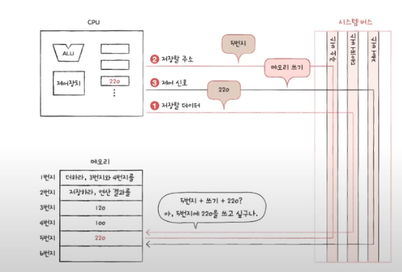
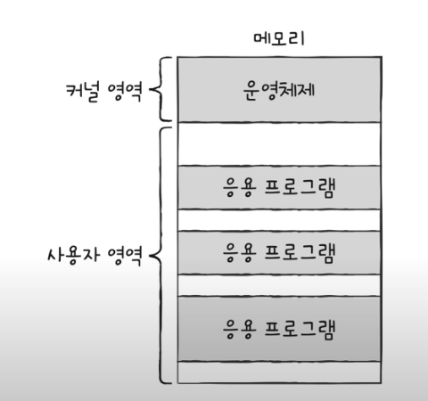
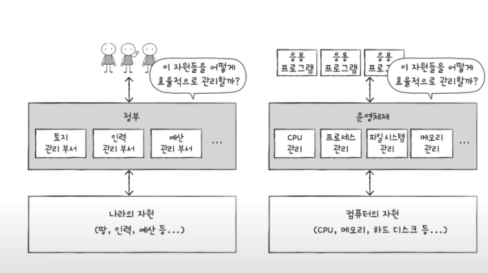

# 운영체제

github.com/gangtaegong/self-learning-cs 참조

# 구조

## 컴퓨터가 이해하는 정보

- 데이터: 숫자 문자 이미지 동영상 같은 정적인 정보.
- 명령어: 컴퓨터를 실질적으로 움직이는 정보, 데이터는 명령어를 위한 재료이다.

=> 명령어를 처리하는 기계가 컴퓨터다

## 동작방식

소스코드 => 명령어 형태로 변환(어셈블리) => 실행

## 컴퓨터의 네가지 핵심부품

- CPU:
  메모리에 있는 명령어 데이터 가져와서 읽고 해석하고 실행한다

  - ALU: 계산기 회로
  - 레지스터: CPU 내부의 작은저장장치(RAM)
  - 제어장치: 제어신호를 내보내고 명령어를 해석하는 장치. 부품을 관리하고 작동시키기 위한 전기신호

  제어장치가 메모리(RAM) 읽기 => 레지스터에 명령어 저장 => 제어장치가 명령어 해석
  => 해석된 결과에 따라 다시 (메모리에)제어신호 전송 => 값 받아서 연산

- 메모리(주기억장치 RAM, ROM):
  현재 실행되는 프로그램의 명령어와 데이터를 저장합니다.
  다양한 정보를 저장. 어떤 값을 어디에 저장했는지 알기 위해 위치 정보가 필요하다.(주소)

- 보조기억장치:
  RAM은 전원이 꺼지면 저장된 내용을 상실한다. 비싸다.
  => 보완하기 위해서 사용한다. 전원이 꺼져도 저장 가능하고, 가격도 비교적 저렴

- 입출력장치:
  모니터 키보드 마우스 스캐너 등등
  메인보드 => 시스템 버스로 정보를 주고 받는다.
  - 시스템 버스 구성 => 주고받는 내용에 따라 아래와 같이 분류함
    주소버스
    데이터 버스
    제어 버스
    

각 장치가 연결되는 장치: 메인보드
서로 정보를 주고받는 통로: 시스템 버스

## 운영체제란?

자원: 프로그램이 실행되기 위해 필요한 요소이다.
컴퓨터의 네가지 핵심 부품이 필요하다
운영체제는 자원을 관리하는 특별한 프로그램이다.
즉 실행중인 프로그램(프로세스)을 관리하는 특별한 프로그램이다.

운영체제는 커널영역에 적재되어 실행된다.
커널 영역 외에는 사용자 영역이라고 한다. 인터넷 메모장 게임 등등

운영체제는 사용자가 쓰는 프로그램을 어떤 주소에 적재할지 결정
더 이상 안 쓰는 프로그램을 메모리에서 해지한다

또 여러개의 프로그램 동시에 실행하는 경우 어떤 순서로 실행할지. 얼마나 오래 실행할지도 결정한다. === CPU 스케줄링, 운영체제에서 관리한다.

프로세스 동기화:
여러 프로세스가 동시에 실행되도 문제 없도록 관리해줌
시스템 콜을 통해 자원을 보호해줌(운영체제가 대신 자원에 접근함으로써)

예) 응용프로그램이 데이터를 하드디스크에 저장 요청
=> 운영체제가 하드디스크 저장 코드 실행 => 하드디스크에 저장

운영체제는 프로그램을 위한 프로그램이기 때문에, 프로그램 개발자는 운영체제에 대해 알아야 한다
(테스트 오류 메세지..)
