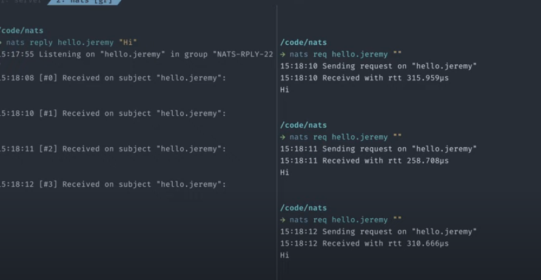
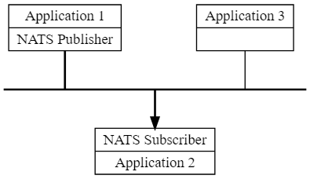

NATS

2가지로 나뉜다
nats core

jetstream

nats core

cli 툴 써 볼 수 있다.

설치 후 서버 실행
서버 실행시 접근가능한 계정을 준다.
40개의 클라이언트 라이브러리 지원해준다

subject based addressing 으로 통신한다.

요청 시 페이로드는 JSON, BSON 등 가능하다.

서비스 : 요청 => 응답받는것

팬아웃, 구독 등의 패턴을 사용할 수 있다.

큐 그룹: 로드를 골고루 배분할 수 있다. 수평적 배분이 가능.

와일드카드의 사용:
구독시 \* 사용하면.. 원하는 메세지 어떤거든 받을 수 있음
https://www.youtube.com/watch?v=hjXIUPZ7ArM&t=14s

<기본개념>

NATS 만의 장점
(What makes the NATS connective technology unique for these modern systems?)

1. 다대다 연결이 손쉬움. (Effortless M:N connectivity)
   호스트명과 포트번호가 아닌, subjects란 개념으로 연결을 한다.

(ask how many other moving parts are required for production to work around the assumption of 1:1? Things like load balancers, log systems, and network security models, as well as proxies and sidecars. => 수많은 서비스들 간 통신 관리의 복잡성을 줄여준다?)

2. 어디서든 배포..
   on bare metal, in a VM, as a container, inside K8S, on a device, or whichever environment you choose

3. 보안성

4. 확장성
   NATS infrastructure and clients communicate all topology changes in real-time. This means that NATS clients do not need to change when NATS deployments change.

5. 복합적 배포..
   it allows a hybrid mix of SaaS/Utility computing with separately owned and operated systems.

6. 유연성
   As modern systems continue to evolve and utilize more components and process more data, supporting patterns beyond 1:1 communications, with addressing and discovery tied to DNS is critical.

<비교해보기>
NATS Comparison to Kafka, Rabbit, gRPC, and others

다른 플랫폼에 비해 지원해주는 클라이언트 종류가 많다.
유지도 활발히 되고있음

스트림, 서비스 2가지 개념이 있고,
이 둘은 구독/발행시스템, 요청-응답, 그리고 로드밸런싱된 큐 구독 패턴을 통해서 가능하다.
다양한 요청 허용, 요청 subject 지원.

메세지 송신 보장성은 최대 한번,최소 한번, 그리고 정확히 한번 송신 가능 (jetStream 사용시)

또한 공유된 스트림과 서비스를 통해 멀티테넌시를 지원하고, 분산된 보안을 지원한다.

모니터링한 데이터를 그라파나, 프로메테우스에 전달하는 것이 가능하다.
nats-top라는 모니터링 툴도 존재한다.

운영시간에서도 서버 설정을 바꿀 수 있음.

다른 플랫폼들도 지원한다:
NATS supports WebSockets, a Kafka bridge, an IBM MQ Bridge, a Redis Connector, Apache Spark, Apache Flink, CoreOS, Elastic, Elasticsearch, Prometheus, Telegraf, Logrus, Fluent Bit, Fluentd, OpenFAAS, HTTP, and MQTT, and more.

[핵심개념]
NATS is an infrastructure that allows such data exchange, segmented in the form of messages. We call this a "message oriented middleware".

Effortlessly build distributed and scalable client-server applications.
Store and distribute data in realtime in a general manner. This can flexibly be achieved across various environments, languages, cloud providers and on-premises systems.



nats가 보장하는 것:
구독자가 고장난 경우에는 메세지를 받을 수 없도록 되어있다. 이는 TCP/IP 개념과 동일함
Core NATS is a fire-and-forget messaging system.
It will only hold messages in memory and will never write messages directly to disk.

최소, 정확히 한번만 전송.
At-least / exactly once
NATS JetStream으로 보장 가능. NATS 안에 내장되어 있는 기능인데, 사용한다는 옵션을 켜줘야 한다.

## 설치

Installing via Docker
With Docker you can install the server easily without scattering binaries and other artifacts on your system. The only pre-requisite is to install docker.

```
docker pull nats:latest
```

To run NATS on Docker:

```
docker run -p 4222:4222 -ti nats:latest
[1] 2019/05/24 15:42:58.228063 [INF] Starting nats-server version #.#.#
[1] 2019/05/24 15:42:58.228115 [INF] Git commit [#######]
[1] 2019/05/24 15:42:58.228201 [INF] Starting http monitor on 0.0.0.0:8222
[1] 2019/05/24 15:42:58.228740 [INF] Listening for client connections on 0.0.0.0:4222
[1] 2019/05/24 15:42:58.228765 [INF] Server is ready
[1] 2019/05/24 15:42:58.229003 [INF] Listening for route connections on 0.0.0.0:6222
```

More information on containerized NATS is available here.

go 바이너리 설치 및 실행:

```
go install github.com/nats-io/nats-server/v2@latest

이후

nats-server
```

제트스트림 활성화를 원한다면 실행시

```
nats-server -js
```

제트스트림을 설정파일로 컨트롤해 실행하고 싶은 경우

```
nats-server -c js.conf
```

# js.conf

jetstream {
store_dir=nats
}

제트스트림은 클러스터 모드로 동작하기 때문에 제트스트림 데이터는 SSD에 두는게 제일 적합하다.
Normally JetStream will be run in clustered mode and will replicate data, so the best place to store JetStream data would be locally on a fast SSD. One should specifically avoid NAS or NFS storage for JetStream. More information on containerized NATS is available here.

[]윈도우에서 nats 실행하는 가장 적합한 방법

```
sc.exe create nats-server binPath= "%NATS_PATH%\nats-server.exe [nats-server flags]"
sc.exe start nats-server
```

명령어 실행 옵션들:
https://docs.nats.io/running-a-nats-service/introduction/flags

환경적으로 고려해야 할것들

1. 네트워킹, 로드밸런서들..
   It is possible to deploy a load balancer between the client applications and the cluster servers (or even between servers in a cluster or between clusters in a super-cluster), but you don't need to:
   NATS에서는 이미 로드밸런싱 가능

예제
https://natsbyexample.com/
